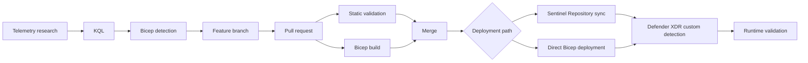

# Detection-as-Code Architecture

## Resource path

```text
Advanced Hunting telemetry
          |
          v
      KQL research
          |
          v
 Microsoft Security Bicep extension
          |
          v
Microsoft.Security/detectionRules@2026-06-01-preview
          |
          +-----------------------------+
          |                             |
          v                             v
Sentinel Repository sync          Direct Bicep deployment
          |                             |
          +---------------+-------------+
                          |
                          v
              Defender XDR custom detection
                          |
                          v
                     Alert / action
```

## Git flow



## State model

The repository should represent the desired detection state.

```text
Desired state  = Git/Bicep
Observed state = Defender XDR detection

Drift = Desired state != Observed state
```

Avoid maintaining a repository-managed rule and an independently edited portal copy as separate authoritative states.
